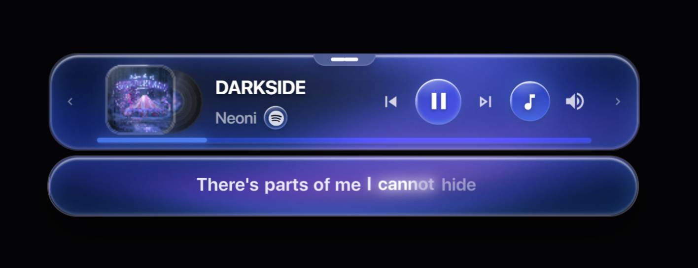

# SGlassify

**Music, poured into glass.**

A glass now-playing widget for the Windows desktop, with word-by-word synced lyrics.

[**Download for Windows**](https://github.com/TevadYt/spotify-glassify-widget/releases/latest)

 

 

## Lyrics that keep time

Each word fills in as it is sung, not just each line. Background vocals light up on their own timing, and the lyrics can be translated into your language as they play. Cinema view opens the full lyrics in a larger window.

Lyrics come from Spicy Lyrics, Musixmatch, LRCLIB and NetEase. When more than one has the song, SGlassify uses the one whose timing matches the release.

## Plays along with any player

SGlassify reads what Windows is already playing, so there is nothing to connect.

- **Spotify**, **SoundCloud**, **YouTube**, **YouTube Music**, **Apple Music** and **Deezer**
- Music in your browser, including background tabs
- **Auto source** follows whichever app starts playing. The badge next to the artist shows the source; click it to switch.

## Volume for the player only

The volume slider changes the player's own volume through Windows' per-app audio. Your system volume and other apps stay where you left them.

## Pick a shape

<table>
<tr>
<td width="40%" valign="top">

</td>
<td valign="top">

**Default**: a slim bar with lyrics underneath.

**Panel**: a tall card built around the album art.

**Island**: a small pill that stays out of the way.

**Pixel** and **Vox**: retro and expressive.

Every shape picks up its colour from the album art. Liquid Glass buttons are optional and take on the same colours.

The widget snaps to screen edges, can tuck away at the edge until you need it, and stays above other windows when you want it to.

</td>
</tr>
</table>

## Also included

- **Discord**: show what you are listening to on your profile, with cover art and live progress.
- **SoundCloud comments**: timed comments appear as marks on the progress bar. Hover one to read it.
- **Light on memory**: built to stay under 75 MB.
- **Interface languages**: English, Arabic, German and Chinese.
- **Updates**: a short notice appears when a new version is ready. One click installs it in place.

 

## Install

1. Download **`Spotify-Glassify-Widget-Setup-<version>.exe`** from the [latest release](https://github.com/TevadYt/spotify-glassify-widget/releases/latest).
2. Run it and choose **Install Now**.
3. Play something.

Windows may show a SmartScreen notice the first time you run a new app. Choose **More info**, then **Run anyway**.

**Requirements:** Windows 10 or 11 (64-bit).

 

---

Made by <a href="https://github.com/TevadYt">Tevad</a>. SGlassify is an independent project. It is not affiliated with or endorsed by Spotify, SoundCloud, Apple, Google, Deezer or Discord.

